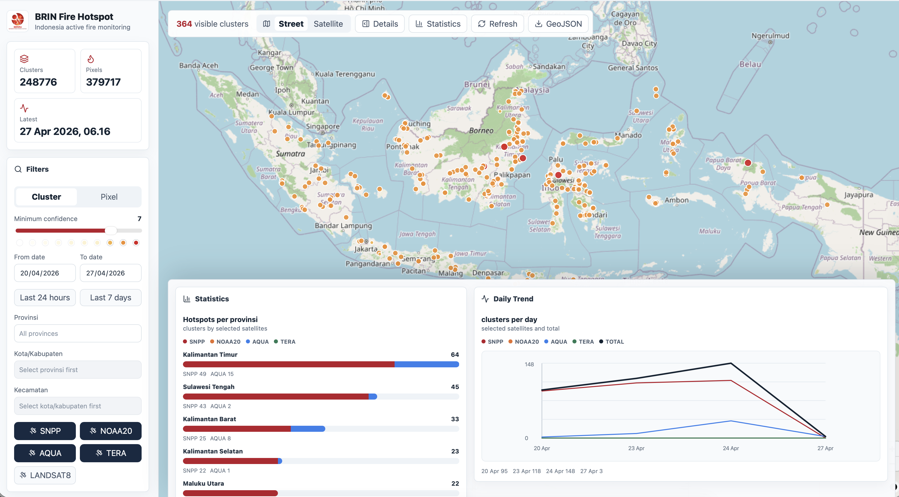

# BRIN Hotspot

<p align="center">
  
</p>

<p align="center">
  <a href="LICENSE">
    
  </a>
</p>

Modernized hotspot processing for the BRIN/LAPAN Indonesia fire detection pipeline.

## Description

BRIN Hotspot Modernization is a containerized processing and dissemination system for Indonesia fire hotspot data. It ingests satellite hotspot products from SNPP, NOAA20, AQUA, TERA, and Landsat 8, normalizes them into a common model, enriches detections with administrative reference data, clusters related detections, and persists the results into PostgreSQL/PostGIS.

The project also provides two read-only dissemination paths: a FastAPI service for machine access and a MapLibre web dashboard for operational visualization. The frontend supports street and satellite basemaps, hotspot filtering, satellite toggles, regional highlighting, status monitoring, and GeoJSON export.

## Motivation

The legacy hotspot workflow is valuable but difficult to operate, test, and extend consistently across satellite families and deployment environments. This modernization effort creates a reproducible runtime with explicit configuration, structured logs, database-backed checkpointing, source-file replay controls, and isolated handling for legacy MODIS HDF4 dependencies.

The system is designed to support operational backfill and continuous ingestion while reducing duplicate work, making failures easier to inspect, and giving developers and data users a stable read-only API for downstream integration.

## Goal

The goal is to provide a reliable, maintainable, and production-oriented hotspot platform that can:

- process multi-satellite hotspot inputs with consistent enrichment, filtering, clustering, and persistence behavior
- continue safely after interrupted runs using source-file checkpointing and replay/reset admin commands
- separate raw data processing from read-only data dissemination
- expose hotspot information through both a web visualization frontend and documented API access
- run the worker, API, frontend, database, and MODIS converter as containerized services from the same Docker Compose stack
- keep raster and scene-overlay support extensible for future satellite image visualization workflows

## Documentation

Developer and operator documentation is available in `docs/`:

- [Backend documentation](docs/backend.md): ingestion, database, source-file checkpointing, worker, MODIS conversion, raster metadata, configuration, and backend operations.
- [API reference](docs/api-reference.md): read-only API endpoints, filters, response shapes, and integration notes.
- [Frontend documentation](docs/frontend.md): React/MapLibre dashboard architecture, filters, basemaps, rails, charts, build workflow, and production notes.

## Technology Stack

| Layer | Technologies |
| --- | --- |
| Backend application | Python 3.14, Typer CLI, FastAPI, Pydantic, Uvicorn |
| Database and geospatial storage | PostgreSQL 16, PostGIS 3.4, psycopg |
| Geospatial/raster tooling | GDAL, HDF4 sidecar conversion, GeoJSON reference data, XYZ tile generation |
| Frontend application | React 19, TypeScript, Vite, MapLibre GL, Lucide React |
| Frontend serving | Nginx static hosting with `/api/*` proxying to FastAPI |
| Container runtime | Docker, Docker Compose, service profiles for worker and MODIS converter |
| Testing and quality | pytest, Ruff, TypeScript compiler, Vite production build |

## Supported Inputs

| Command | Input Type | Notes |
| --- | --- | --- |
| `hotspot ingest snpp` | `AFIMG_npp*.txt` | VIIRS text hotspot files. |
| `hotspot ingest noaa20` | `AFIMG_j01*.txt` | VIIRS text hotspot files. |
| `hotspot ingest aqua` | `a1*.mod14.hdf`, `a1*.mod14.hotspots.csv` | MODIS fire-pixel files. Converted CSV is preferred when both exist. |
| `hotspot ingest tera` | `t1*.mod14.hdf`, `t1*.mod14.hotspots.csv` | MODIS fire-pixel files. Converted CSV is preferred when both exist. |
| `hotspot ingest landsat8` | `LC08*firepixels.txt`, `LO08*firepixels.txt` | Grouped by acquisition date and WRS path. |

MODIS HDF parsing requires `pyhdf` in runtime environments that process real AQUA/TERA HDF4 files. The parser imports `pyhdf` lazily so the rest of the CLI and tests remain usable without HDF4 support installed.

The Docker image installs GDAL and compatible HDF4 native libraries. To try installing the optional Python `pyhdf` package during image build, use:

```bash
docker compose build --build-arg INSTALL_HDF=true worker
```

Current Python 3.14 status: the optional HDF build reaches native compilation but fails inside the upstream `pyhdf` C wrapper against the current Debian/HDF4 headers. To keep the main application on Python 3.14, raw HDF4 conversion is isolated in a `modis-converter` sidecar image that writes neutral CSV files for the main ingestion pipeline.

## Architecture

The modernized code separates satellite-specific parsing from shared ingestion behavior:

- `src/brin_hotspot/satellites/`: filename discovery and parser logic for each input family.
- `src/brin_hotspot/ingestion/hotspot.py`: shared ingestion orchestration.
- `src/brin_hotspot/ingestion/clustering.py`: connected-neighbor clustering.
- `src/brin_hotspot/ingestion/csv_export.py`: cluster and pixel CSV outputs.
- `src/brin_hotspot/repositories/`: PostGIS persistence, enrichment, and reference-data import.
- `src/brin_hotspot/migrations.py`: versioned schema migration execution.
- `src/brin_hotspot/raster.py`: GeoTIFF discovery, footprint extraction, and tile command execution.
- `src/brin_hotspot/worker.py`: scheduled ingestion loop and one-shot ingestion cycle dispatch.
- `src/brin_hotspot/config.py`: separated runtime configuration.
- `src/brin_hotspot/logging_config.py`: structured logging setup.

The shared ingestion flow is:

1. Discover input source files.
2. Skip already-completed source files when database persistence is enabled.
3. Parse satellite-specific detections.
4. Optionally enrich detections with PostGIS administrative boundaries.
5. Optionally filter persistent anomalies and duplicate pixels.
6. Cluster detections using satellite-specific resolution rules.
7. Write cluster and pixel CSV outputs for each source item.
8. Optionally persist each source item independently into PostGIS.
9. Mark each source file `completed` only after persistence succeeds, including valid sources whose detections were fully filtered by enrichment rules.

This source-level checkpointing is important for operational runs. If a long ingestion is interrupted, files already marked `completed` are skipped on the next run, stale `running` files are reset to `pending`, and remaining or failed files can be retried without replaying the whole tree. Source files are tracked by a stable `source_key` as well as by path, so the same scene or production file can be skipped even when it is found under a different input root.

## Hotspot Detection Process

SNPP and NOAA20 use the same VIIRS active-fire text flow:

1. The worker scans each real input tree recursively.
   - SNPP reads `AFIMG_npp*.txt`.
   - NOAA20 reads `AFIMG_j01*.txt`.
2. Each text file is treated as one source item. With database persistence enabled, the file is skipped when a matching `source_key` or path is already `completed`.
3. Observation time is derived from the production filename, for example `d20250101_t0407536`.
4. Each valid hotspot row is normalized into a common pixel record containing latitude, longitude, confidence, observed time, satellite, scene id, source station, and source file.
5. With `--enrich`, each pixel is matched against the imported PostGIS province, kabupaten, and kecamatan polygons. Pixels outside the imported boundary set remain valid hotspot pixels but keep null administrative fields.
6. Persistent anomaly filtering and duplicate filtering are applied when enrichment/database mode is enabled.
7. Remaining pixels are clustered using satellite-specific spatial resolution settings.
8. Cluster and pixel CSV files are written, then clusters and pixels are persisted to PostGIS. The source file is marked `completed` only after persistence succeeds, even when all detections were filtered as persistent anomalies or duplicates.

AQUA and TERA use a two-stage MODIS flow because production MODIS inputs are HDF4:

1. `modis-converter` or the satellite-specific converter services scan raw MODIS HDF4 files recursively under mounted input roots.
2. The converter accepts standard MODIS names such as `a1*.mod14.hdf` and `t1*.mod14.hdf`, plus production wrapper files such as `*.AQUA_OR.data` and `*.TERA_OR.data`.
3. It reads MOD14 fire-pixel datasets such as `FP_latitude`, `FP_longitude`, and `FP_confidence`.
4. Each HDF or production wrapper file is converted to a neutral `*.mod14.hotspots.csv` file under `/app/data/output/modis-converted`, preserving the relative input tree.
   - A production file such as `20240709145617.TERA_OR.data` is emitted as a worker-readable scene such as `t1.24191.1456.mod14.hotspots.csv`.
5. Empty MODIS granules become header-only CSV files. Failed granules are reported in converter logs and do not stop the whole conversion cycle.
6. The converter uses `--skip-existing` in service mode, so already converted files are not rewritten unless the source HDF is newer. Output replacement is atomic so the worker does not ingest half-written CSV files.
7. `worker-aqua-service` and `worker-tera-service` ingest converted CSV directories, not the raw HDF directories.
8. MODIS converted CSV rows are normalized into the same common hotspot pixel model as VIIRS, then enrichment, filtering, clustering, CSV export, persistence, and source-file checkpointing use the shared ingestion engine.

Operationally, SNPP, NOAA20, AQUA, and TERA therefore converge into the same database model:

- `source_files` tracks whether each input file is `pending`, `running`, `completed`, or `failed`.
- `source_files.source_key` stores the stable production file or scene identity used to skip duplicates across different input roots.
- `ingestion_runs` records each command or worker cycle run.
- `hotspot_pixel` stores individual detections.
- `hotspot_cluster` stores clustered hotspot groups.
- Administrative enrichment fields are updated on conflict, so replaying completed sources after reference-data import can backfill province, kabupaten, and kecamatan values.

## Local Python

If using the prepared pyenv virtual environment:

```bash
pyenv activate hotspot
python -m pip install -e ".[dev]"
hotspot --help
```

Run checks:

```bash
pytest
ruff check .
```

## Docker

OrbStack can run the Docker Compose stack:

```bash
docker compose up --build
```

Run a health check through the worker:

```bash
docker compose run --rm worker hotspot health
```

Check database connectivity:

```bash
docker compose run --rm worker hotspot health --database
```

Apply schema migrations:

```bash
docker compose run --rm worker hotspot db migrate
```

Stop the stack without deleting the database volume:

```bash
docker compose down
```

## Ingestion Commands

Run SNPP ingestion:

```bash
hotspot ingest snpp --input-dir data/input/snpp
```

Persist parsed SNPP clusters and pixels into PostGIS:

```bash
hotspot ingest snpp --input-dir data/input/snpp --database
```

Apply PostGIS admin-boundary enrichment plus persistent-anomaly and duplicate filtering:

```bash
hotspot ingest snpp --input-dir data/input/snpp --database --enrich
```

Repeat `--input-dir` to ingest more than one root in a single run. The search is recursive under each root:

```bash
hotspot ingest snpp \
  --input-dir /mnt/geomimo-data/DataProses/Suomi-NPP \
  --input-dir /mnt/geomimo-data/DataProses/BUFFER/CloudData/Produk/SNPP \
  --database \
  --enrich
```

Run NOAA20 ingestion:

```bash
hotspot ingest noaa20 --input-dir data/input/noaa20
hotspot ingest noaa20 --input-dir data/input/noaa20 --database --enrich
```

Run AQUA and TERA MODIS ingestion:

```bash
hotspot ingest aqua --input-dir data/input/aqua
hotspot ingest tera --input-dir data/input/tera
```

If using raw MODIS HDF4 files, convert them first:

```bash
docker compose run --rm modis-converter --input-dir /app/data/input --output-dir /app/data/input
```

The converter writes `*.mod14.hotspots.csv` files into the chosen output tree. The main AQUA/TERA ingestion commands prefer converted CSV files over matching raw HDF files, which avoids duplicate processing when both are present.

MODIS granules with no fire pixels are converted to header-only CSV files. Files that cannot be read are reported to stderr and do not stop the whole conversion run.

Run Landsat 8 ingestion:

```bash
hotspot ingest landsat8 --input-dir data/input/landsat8
hotspot ingest landsat8 --input-dir data/input/landsat8 --database --enrich
```

## Operational Admin

List recent ingestion runs:

```bash
hotspot admin runs --limit 20
hotspot admin runs --satellite snpp --status completed
```

List source-file status:

```bash
hotspot admin sources --limit 20
hotspot admin sources --satellite landsat8 --status completed
```

Replay a source file by marking it pending:

```bash
hotspot admin replay-source --satellite snpp --path data/input/snpp/2026/04/24/054359000/AFIMG_npp_d20260424_t0543590_e0550000.txt
```

The next `hotspot ingest ... --database` run will process a replayed source again because only `completed` source files are skipped.

Replay completed files for a whole satellite, for example after importing reference data and wanting to rerun enrichment:

```bash
hotspot admin replay-satellite --satellite snpp --status completed
```

Reset interrupted `running` source files to `pending`:

```bash
hotspot admin reset-running --satellite snpp
```

Reset all interrupted `running` source files:

```bash
hotspot admin reset-running
```

Database-backed ingestion also resets stale `running` source files for the selected satellite at startup. This lets an interrupted service run continue on the next cycle without manual SQL.

Operational cleanup commands:

```bash
# Reset interrupted files before retrying a satellite.
docker compose run --rm worker hotspot admin reset-running --satellite snpp
docker compose run --rm worker hotspot admin reset-running --satellite noaa20
docker compose run --rm worker hotspot admin reset-running --satellite aqua
docker compose run --rm worker hotspot admin reset-running --satellite tera

# Replay completed files after importing reference data or changing enrichment logic.
docker compose run --rm worker hotspot admin replay-satellite --satellite snpp --status completed
docker compose run --rm worker hotspot admin replay-satellite --satellite noaa20 --status completed
docker compose run --rm worker hotspot admin replay-satellite --satellite aqua --status completed
docker compose run --rm worker hotspot admin replay-satellite --satellite tera --status completed

# Replay failed files after fixing parser/input issues.
docker compose run --rm worker hotspot admin replay-satellite --satellite snpp --status failed
```

## Raster Metadata

Scan GeoTIFF fire-index rasters and derive footprints with `gdalinfo`:

```bash
hotspot raster scan --input-dir data/input/rasters
```

Persist raster metadata into the raster PostGIS database:

```bash
hotspot raster scan --input-dir data/input/rasters --database
```

Supported raster filename families include `SNPP_*_FI.tif`, `NOAA20_*_FI.tif`, `AQUA_*_FI.tif`, `TERA_*_FI.tif`, and `L8_*_FI.tif`.

Generate XYZ web tiles for discovered rasters:

```bash
hotspot raster tile --input-dir data/input/rasters --output-dir data/output/tiles --zoom 5-12
```

Tiles are written under one directory per raster source file. Existing tiles are resumed by GDAL, so interrupted tile jobs can be run again.

## Worker

Run one ingestion cycle across all enabled satellite families:

```bash
hotspot worker run-once --database --enrich
```

Limit a cycle to a specific satellite:

```bash
hotspot worker run-once --satellite noaa20 --database --enrich
```

Run a repeated worker loop:

```bash
hotspot worker loop --interval-seconds 300 --database --enrich
```

Use `--max-cycles 0` for a long-running service loop. `0` is the default for
`worker loop`; use a positive value for testing:

```bash
hotspot worker loop \
  --satellite snpp \
  --satellite noaa20 \
  --satellite aqua \
  --satellite tera \
  --input snpp=/app/data/input/snpp \
  --input snpp=/app/data/input/snpp-buffer \
  --input noaa20=/app/data/input/noaa20 \
  --input noaa20=/app/data/input/noaa20-buffer \
  --input aqua=/app/data/output/modis-converted/aqua/original \
  --input aqua=/app/data/output/modis-converted/aqua/buffer \
  --input tera=/app/data/output/modis-converted/tera/original \
  --input tera=/app/data/output/modis-converted/tera/buffer \
  --interval-seconds 300 \
  --max-cycles 0 \
  --database \
  --enrich
```

The worker uses the same source-file idempotency tables as direct ingestion commands. Completed database-backed files are skipped unless they are explicitly replayed, so the loop can safely revisit the same input folders and process newly-arrived files. Repeat `--input satellite=/path` to add multiple roots for the same satellite, which is useful for original and BUFFER input trees.

Run the Docker Compose service profile:

```bash
docker compose --profile service up -d \
  modis-converter-aqua-service \
  modis-converter-tera-service \
  worker-snpp-service \
  worker-noaa20-service \
  worker-aqua-service \
  worker-tera-service
docker compose logs -f worker-snpp-service
docker compose --profile service stop \
  worker-snpp-service \
  worker-noaa20-service \
  worker-aqua-service \
  worker-tera-service \
  modis-converter-aqua-service \
  modis-converter-tera-service
```

The default service profile processes SNPP, NOAA20, AQUA, and TERA with enrichment enabled. `modis-converter-aqua-service` and `modis-converter-tera-service` refresh HDF4 files from original and BUFFER MODIS roots into `/app/data/output/modis-converted`, and the satellite-specific worker services ingest independently from their own input roots.

Enable file-level tracing when diagnosing discovery, skip, conversion, or ingestion behavior:

```bash
HOTSPOT_TRACE_FILES=true MODIS_CONVERTER_DEBUG=true \
  docker compose --profile service up -d --force-recreate \
  worker-snpp-service \
  worker-noaa20-service \
  worker-aqua-service \
  worker-tera-service \
  modis-converter-aqua-service \
  modis-converter-tera-service
```

For production-style runs, mount each real satellite source directory directly:

```yaml
- /mnt/geomimo-data/DataProses/Suomi-NPP:/app/data/input/snpp:ro
- /mnt/geomimo-data/DataProses/BUFFER/CloudData/Produk/SNPP:/app/data/input/snpp-buffer:ro
- /mnt/geomimo-data/DataProses/NOAA-20:/app/data/input/noaa20:ro
- /mnt/geomimo-data/DataProses/BUFFER/CloudData/Produk/NOAA20:/app/data/input/noaa20-buffer:ro
- /mnt/geomimo-data/DataProses/AQUA:/app/data/input/aqua:ro
- /mnt/geomimo-data/DataProses/Terra:/app/data/input/tera:ro
- /mnt/geomimo-data/DataProses/BUFFER/CloudData/Produk/modis:/app/data/input/modis-buffer:ro
```

Do not bind `./data/input:/app/data/input` at the same time for production ingestion. The local parent bind can create placeholder `snpp`, `noaa20`, `aqua`, and `tera` directories under `data/input`, which is confusing and can hide whether the container is reading the real `/mnt/geomimo-data` source.

Server workflow after code changes:

```bash
docker compose build worker
docker compose build modis-converter
docker compose run --rm worker hotspot health --database
docker compose run --rm worker hotspot admin reset-running
docker compose --profile service up -d \
  modis-converter-aqua-service \
  modis-converter-tera-service \
  worker-snpp-service \
  worker-noaa20-service \
  worker-aqua-service \
  worker-tera-service
```

Monitor the service:

```bash
docker compose ps
docker compose logs -f worker-snpp-service
docker compose logs -f worker-noaa20-service
docker compose logs -f worker-aqua-service
docker compose logs -f worker-tera-service
docker compose logs -f modis-converter-aqua-service
docker compose logs -f modis-converter-tera-service
docker compose exec db psql -U hotspot -d hotspot -c "
select satellite, status, count(*)
from source_files
group by satellite, status
order by satellite, status;
"
```

Stop or restart the service:

```bash
docker compose --profile service stop \
  worker-snpp-service \
  worker-noaa20-service \
  worker-aqua-service \
  worker-tera-service \
  modis-converter-aqua-service \
  modis-converter-tera-service
docker compose --profile service restart \
  modis-converter-aqua-service \
  modis-converter-tera-service \
  worker-snpp-service \
  worker-noaa20-service \
  worker-aqua-service \
  worker-tera-service
```

For a short service smoke test, override the cycle count:

```bash
HOTSPOT_WORKER_MAX_CYCLES=1 docker compose --profile service up worker-snpp-service
```

To smoke-test one converter cycle manually:

```bash
docker compose run --rm modis-converter \
  --input-dir /app/data/input/aqua \
  --output-dir /app/data/output/modis-converted/aqua \
  --satellite aqua \
  --skip-existing
```

The service is idempotent when `--database` is enabled: `completed` source files are skipped, interrupted `running` files are reset on startup, and newly-arrived files are processed on later cycles.

## API and Frontend

The project exposes hotspot data through two read-only dissemination paths:

- `api`: JSON and GeoJSON access for downstream systems.
- `frontend`: web visualization served by Nginx, with `/api/*` proxied to the API container.

Start the database, API, and frontend:

```bash
docker compose up --build db api frontend
```

Open the web dashboard at `http://localhost:8080`. The API is available at `http://localhost:8000`.

Developer API documentation is generated from the FastAPI OpenAPI schema:

- Interactive Swagger UI: `http://localhost:8000/docs`
- OpenAPI schema: `http://localhost:8000/openapi.json`

The OpenAPI schema can be imported into Postman, Insomnia, Swagger UI, or client SDK generators.

Build or restart individual services:

```bash
docker compose build api frontend
docker compose up -d api frontend
docker compose stop frontend
docker compose start frontend
```

Useful API endpoints:

```bash
curl http://localhost:8000/api/v1/health
curl http://localhost:8000/api/v1/summary
curl "http://localhost:8000/api/v1/locations?province=Riau&kabupaten=Pelalawan"
curl "http://localhost:8000/api/v1/hotspots?kind=cluster&satellite=snpp&min_confidence=7&limit=1000"
curl "http://localhost:8000/api/v1/hotspots?kind=pixel&satellite=snpp&satellite=noaa20&observed_from=2026-04-24T00:00:00&observed_to=2026-04-24T23:59:59&province=Riau&kabupaten=Pelalawan&kecamatan=Menteng"
curl "http://localhost:8000/api/v1/statistics?kind=cluster&satellite=snpp&satellite=noaa20&province=Riau"
curl "http://localhost:8000/api/v1/trend?kind=cluster&satellite=snpp&satellite=noaa20&observed_from=2026-04-24T00:00:00&observed_to=2026-04-27T23:59:59"
curl "http://localhost:8000/api/v1/runs?limit=20"
curl "http://localhost:8000/api/v1/source-files?status=failed&limit=20"
```

`/api/v1/hotspots` returns a GeoJSON `FeatureCollection` with:

- `features`: the returned map features, bounded by the requested `limit` for browser and API payload safety.
- `total`: the actual number of matching clusters or pixels after filters, which can be larger than the returned feature count.

The hotspot endpoint supports these read-only filters:

- `kind=cluster|pixel`
- repeated `satellite` parameters
- `observed_from` and `observed_to`
- `min_confidence`
- `province`, `kabupaten`, and `kecamatan`
- `bbox=west,south,east,north`
- `limit`

`/api/v1/statistics` returns grouped hotspot counts for stacked bar charts. It uses the same hotspot filters and automatically chooses the grouping level:

- no `province`: group by province
- `province`: group by kota/kabupaten in that province
- `kabupaten`: group by kecamatan in that kota/kabupaten
- `kecamatan`: group by selected satellites

`/api/v1/trend` returns daily hotspot counts in the active filter range, with counts for each selected satellite and a total count per day.

Frontend access and features:



- local dashboard access at `http://localhost:8080`
- Nginx-served production build with `/api/*` proxied to the API service
- BRIN Hotspot Monitoring System logo and operational map-first layout
- hideable right rail for status, latest run per satellite, and the latest two source files per satellite
- hideable bottom statistics rail controlled from the map toolbar
- actual filtered visible count from the API `total`, not only the number of returned map features
- manual refresh and GeoJSON export

Map and filter features:

- basemap switcher between OpenStreetMap street tiles and ESRI World Imagery satellite tiles
- cluster/pixel mode switching
- minimum-confidence filter
- date-only from/to filters
- quick date presets for the last 24 hours and last 7 days, which update the from/to date fields
- searchable province, kota/kabupaten, and kecamatan selection
- satellite toggles that show or hide matching hotspots on the map
- selected-region highlighting with non-selected hotspots greyed out
- stacked bar chart for hotspot counts by administrative level and selected satellites
- daily trend line chart for hotspot counts by selected satellites plus total

The frontend also works with mock data when the API is unavailable, which keeps UI development possible before a local database is populated.

## Reference Data

Import reference polygons from GeoJSON:

```bash
hotspot admin import-geojson province --file data/reference/provinces.geojson --id-field gid --name-field wa
hotspot admin import-geojson kabupaten --file data/reference/kabupaten.geojson --id-field gid --name-field wa --prov-id-field prov_id
hotspot admin import-geojson kecamatan --file data/reference/kecamatan.geojson --id-field gid --name-field wa --prov-id-field prov_id --kab-id-field kab_id
hotspot admin import-geojson anomaly --file data/reference/anomalies.geojson --id-field gid --name-field name
```

Reference GeoJSON files must be valid `FeatureCollection` documents. Imported geometries are stored as `MultiPolygon` SRID 4326 geometries.

After reference data is imported, rerun ingestion with `--database --enrich`. Existing hotspot rows are updated with enriched administrative fields on conflict, so replaying completed source files can backfill province, kabupaten, and kecamatan values.

## Verification

Check application and database connectivity:

```bash
docker compose run --rm worker hotspot health --database
```

Check source-file progress:

```bash
docker compose exec db psql -U hotspot -d hotspot -c "
select satellite, status, count(*) as source_files
from source_files
group by satellite, status
order by satellite, status;
"
```

Check persisted pixels and enrichment coverage:

```bash
docker compose exec db psql -U hotspot -d hotspot -c "
select satellite,
       count(*) as pixels,
       count(provinsi) as with_province,
       count(kabupaten) as with_kabupaten,
       count(kecamatan) as with_kecamatan
from hotspot_pixel
group by satellite
order by satellite;
"
```

Check recent ingestion runs:

```bash
docker compose run --rm worker hotspot admin runs --limit 20
docker compose run --rm worker hotspot admin sources --limit 20
```

Check MODIS conversion output:

```bash
find data/output/modis-converted/aqua -type f -name '*.mod14.hotspots.csv' | wc -l
find data/output/modis-converted/aqua -type f -name '*.mod14.hotspots.csv' | head
find data/output/modis-converted/tera -type f -name '*.mod14.hotspots.csv' | wc -l
find data/output/modis-converted/tera -type f -name '*.mod14.hotspots.csv' | head
```

Check worker service logs and running containers:

```bash
docker compose ps
docker compose logs --tail 200 worker-snpp-service
docker compose logs --tail 200 worker-noaa20-service
docker compose logs --tail 200 worker-aqua-service
docker compose logs --tail 200 worker-tera-service
docker compose logs --tail 200 modis-converter-aqua-service
docker compose logs --tail 200 modis-converter-tera-service
```

## Configuration

Copy `.env.example` to `.env` and adjust values for the local environment.

No credentials should be committed to this repository.

## License


This project is licensed under the [BSD 3-Clause License](LICENSE).

Copyright (c) 2026, Andria Arisal and Andy Indradjad (BRIN).

## Verification Status

The current implementation has been verified with:

```bash
PYENV_VERSION=hotspot pytest -o cache_dir=/tmp/hotspot-new-pytest-cache
PYENV_VERSION=hotspot RUFF_CACHE_DIR=/tmp/hotspot-new-ruff-cache ruff check .
npm --prefix frontend run build
docker compose build worker
docker compose build api
docker compose build frontend
docker compose build modis-converter
docker compose run --rm modis-converter --input-dir /app/data/input --output-dir /app/data/output/modis-converted
docker compose run --rm worker hotspot db migrate
docker compose run --rm worker hotspot health --database
docker compose run --rm --volume /path/to/hotspot-new/tests:/app/tests:ro worker hotspot ingest aqua --input-dir /app/tests/fixtures/aqua --no-database
docker compose run --rm --volume /path/to/hotspot-new/tests:/app/tests:ro worker hotspot ingest landsat8 --input-dir /app/tests/fixtures/landsat8 --database --enrich
docker compose run --rm --volume /path/to/hotspot-new/tests:/app/tests:ro --env HOTSPOT_INPUT_DIR=/app/tests/fixtures worker hotspot worker run-once --satellite noaa20 --no-database
docker compose run --rm worker hotspot admin runs --limit 5
docker compose run --rm worker hotspot admin sources --limit 5
docker compose run --rm --volume /path/to/hotspot-new/tests:/app/tests:ro worker hotspot raster scan --input-dir /app/tests --no-database
docker compose run --rm --volume /path/to/hotspot-new/tests:/app/tests:ro worker hotspot raster tile --input-dir /app/tests --output-dir /tmp/hotspot-tiles --zoom 5
```
